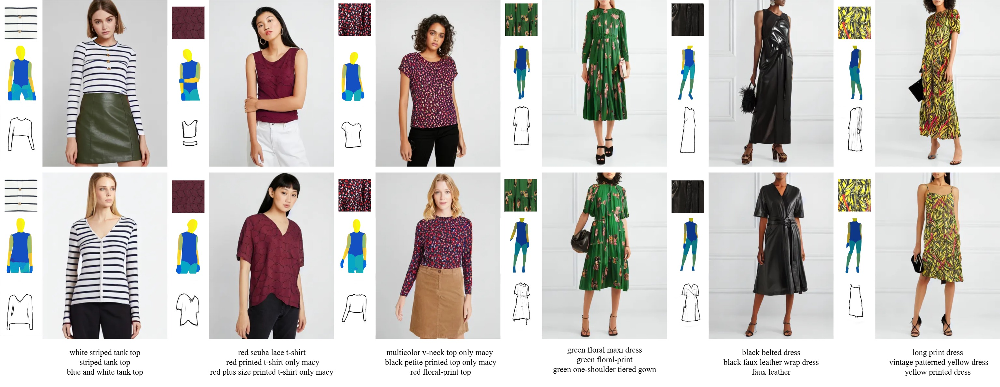

# Texture-Preserving Multimodal Fashion Image Editing with Diffusion Models

<div style="display: flex; justify-content: center; align-items: center;">
  <a href='https://huggingface.co/zibingo/TP-MGD' style="margin: 0 2px;">
    
  </a>
  <a href="https://github.com/zibingo/TP-MGD" style="margin: 0 2px;">
    
  </a>
</div>

## 🎯 Overview

TP-MGD is a new method for texture-preserving multimodal fashion image editing using diffusion models. The project enables high-quality fashion image generation and editing through an innovative lightweight architecture setup while maintaining fine-grained texture details.

<div align="center">
  
</div>

## ✅ TODO

- [x] Release training code
- [x] Release inference code  
- [x] Release processed datasets
- [x] Release checkpoints to Hugging Face
- [x] Create comprehensive documentation
## 🚀 Quick Start

### Installation

```bash
git clone https://github.com/zibingo/TP-MGD.git
cd TP-MGD
```

**Requirements:**

- Python 3.9+
- PyTorch >= 2.5.0
- CUDA >= 12.4

```bash
pip install diffusers accelerate transformers opencv-python einops wandb open_clip_torch
```

### Download Pre-trained Models

```bash
wget https://huggingface.co/h94/IP-Adapter/resolve/main/models/ip-adapter_sd15.bin 
```

## 📊 Dataset Setup

### VITON-HD Dataset

1. **Download VITON-HD**: Get the original dataset from [VITON-HD](https://github.com/shadow2496/VITON-HD)
2. **Download MGD multimodal data**: Get additional data from [MGD](https://github.com/aimagelab/multimodal-garment-designer)
3. **Download preprocessed textures**: 
   
   ```bash
   wget https://huggingface.co/zibingo/TP-MGD/resolve/main/vitonhd-texture.zip
   ```
<details>
<summary>Directory Structure:</summary>
```
├── captions.json                (from MGD)
├── test/
│   ├── agnostic-mask/
│   ├── agnostic-v3.2/
│   ├── cloth/
│   ├── cloth-mask/
│   ├── cloth-texture/           (from Ours)
│   ├── im_sketch/               (from MGD)
│   ├── im_sketch_unpaired/      (from MGD)
│   ├── image/
│   ├── image-densepose/
│   ├── image-parse-agnostic-v3.2/
│   ├── image-parse-v3/
│   ├── openpose_img/
│   └── openpose_json/
├── test_pairs.txt
├── train/
│   ├── agnostic-mask/
│   ├── agnostic-v3.2/
│   ├── cloth/
│   ├── cloth-mask/
│   ├── cloth-texture/           (from Ours)
│   ├── gt_cloth_warped_mask/
│   ├── im_sketch/               (from MGD)
│   ├── image/
│   ├── image-densepose/
│   ├── image-parse-agnostic-v3.2/
│   ├── image-parse-v3/
│   ├── openpose_img/
│   └── openpose_json/
└── train_pairs.txt
```
</details>

### DressCode Dataset

1. **Download DressCode**: Get the original dataset from [DressCode](https://github.com/aimagelab/dress-code)
2. **Download MGD multimodal data**: Get additional data from [MGD](https://github.com/aimagelab/multimodal-garment-designer)
3. **Download preprocessed textures**:
   
   ```bash
   wget https://huggingface.co/zibingo/TP-MGD/resolve/main/dresscode-texture.zip
   ```
<details>
<summary>Directory Structure:</summary>
```
├── dresses/
│   ├── dense/
│   ├── dresses_cloth-texture/    (from Ours)
│   ├── im_sketch/                (from MGD)
│   ├── im_sketch_unpaired/       (from MGD)
│   ├── images/
│   ├── keypoints/
│   ├── label_maps/
│   ├── test_pairs_paired.txt
│   ├── test_pairs_unpaired.txt
│   └── train_pairs.txt
├── lower_body/
│   ├── dense/
│   ├── im_sketch/                (from MGD)
│   ├── im_sketch_unpaired/       (from MGD)
│   ├── images/
│   ├── keypoints/
│   ├── label_maps/
│   ├── lower_body_cloth-texture/ (from Ours)
│   ├── test_pairs_paired.txt
│   ├── test_pairs_unpaired.txt
│   └── train_pairs.txt
├── upper_body/
│   ├── dense/
│   ├── im_sketch/                (from MGD)
│   ├── im_sketch_unpaired/       (from MGD)
│   ├── images/
│   ├── keypoints/
│   ├── label_maps/
│   ├── test_pairs_paired.txt
│   ├── test_pairs_unpaired.txt
│   ├── train_pairs.txt
│   └── upper_body_cloth-texture/  (from Ours)
├── coarse_captions.json           (from MGD)
├── fine_captions.json             (from MGD)
├── multigarment_test_triplets.txt
├── readme.txt
├── test_pairs_paired.txt
├── test_pairs_unpaired.txt
├── test_stitch_map/               (from MGD)
└── train_pairs.txt
```
</details>
**Configuration:** Set the `dataroot_path` in the YAML files under the `configs/` directory.

## 🚀 Usage

### Training

**Single GPU:**
```bash
python train_vitonhd.py
python train_dresscode.py
```

**Multi-GPU**

```bash
CUDA_VISIBLE_DEVICES=0,1 accelerate launch train_vitonhd.py
CUDA_VISIBLE_DEVICES=0,1 accelerate launch train_dresscode.py
```

### Inference

1. **Download pre-trained weights** from [Hugging Face](https://huggingface.co/zibingo/TP-MGD/tree/main) and place them in the `checkpoints/` directory
2. **Update configuration**: Modify the `resume_state` parameter in the YAML files under `configs/` directory to point to your checkpoint directory

**Single GPU:**

```bash
python inference_vitonhd.py
python inference_dresscode.py
```

**Multi-GPU:**

```bash
CUDA_VISIBLE_DEVICES=0,1 accelerate launch inference_vitonhd.py
CUDA_VISIBLE_DEVICES=0,1 accelerate launch inference_dresscode.py
```

## 📁 Project Structure

```
TP-MGD/
├── configs/                 # Configuration files
├── checkpoints/             # Pre-trained model weights
├── assets/                  # Sample images
├── train_vitonhd.py         # VITON-HD training script
├── train_dresscode.py       # DressCode training script
├── inference_vitonhd.py     # VITON-HD inference script
├── inference_dresscode.py   # DressCode inference script
├── datasets.py              # Dataset loading utilities
└── attention_processor.py   # Custom attention mechanisms
```

## 🔧 Configuration

Key configuration parameters in `configs/*.yaml`:

- `dataroot_path`: Path to your dataset
- `resume_state`: Path to checkpoint for inference or resume train

## 🙏 Acknowledgments

- Our code is based on [Diffusers](https://github.com/huggingface/diffusers)
- We use [Stable Diffusion v1.5 inpainting](https://huggingface.co/runwayml/stable-diffusion-inpainting) as the base model
- Thanks to [VITON-HD](https://github.com/shadow2496/VITON-HD), [DressCode](https://github.com/aimagelab/dress-code), and [MGD](https://github.com/aimagelab/multimodal-garment-designer) for providing the public datasets

## 📞 Contact

For questions and support, please open an issue on GitHub or contact the authors.

---

**⭐ If you find this project helpful, please give it a star!**

